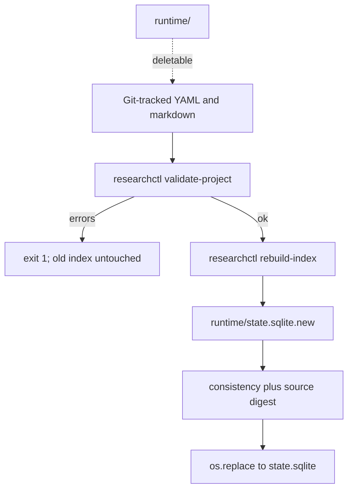

# R0 Kernel — revised implementation-ready plan

Status: **architecture approved in principle; this revision incorporates human decisions; implementation is not authorized until this revision is explicitly approved.**

This document replaces the previous R0 plan. It is the complete plan, not a delta.

**STOP after this plan.** No repository implementation, installs, commits, or R1/R2 work.

---

## 1. Verified current repository state

Inspected `/home/nicacevedo/research/research-os` on 2026-09-08. Unchanged by this planning task.

**Git**
- Branch: `r0/kernel-v1`, clean, even with `main` and `origin/main`
- Single commit: `e35414f` *Bootstrap Research OS foundation*
- Remote: `git@github.com:nicacevedo/research-os.git`

**Substance on disk**
- [DESIGN_INVARIANTS.md](DESIGN_INVARIANTS.md) — complete constitution; **do not modify**
- [ARCHITECTURE.md](ARCHITECTURE.md) — incomplete (24 lines; operating-model diagram cuts off)
- [pyproject.toml](pyproject.toml) — `research-os 0.1.0`, Python `>=3.12,<3.13`, **zero dependencies**, `researchctl = research_os.cli:main`
- [src/research_os/cli.py](src/research_os/cli.py) — `argparse`; `version` and `doctor` only
- [src/research_os/__init__.py](src/research_os/__init__.py) — `__version__ = "0.1.0"`
- [.python-version](.python-version) — `3.12`
- [.gitignore](.gitignore) — already ignores `**/.research/runtime/` (kernel-repo belt; science projects will use `.research/.gitignore` instead of root appends)
- [uv.lock](uv.lock) — editable self only; `uv lock --check` passes

**Empty tracked files:** `README.md`, `ROADMAP.md`, `SECURITY.md`, `MACHINE_AUDIT.md`

**Absent:** tests, schemas, capsule, registry, indexer, config loader

**Runtime (already validated; do not redo machine setup)**
- `uv 0.12.10`; `researchctl version` → `0.1.0`; doctor PASS (Python 3.12.14, git, sqlite3 3.45.1, four XDG dirs)
- Doctor does not check XDG writability

**Host XDG bootstrap leftovers (not R0 contract)**
- `~/.config/research-os` empty
- `~/.local/share/research-os/{literature/{citation_graph,indexes,metadata,parsed,pdf},shared_knowledge}`
- `~/.cache/research-os/{api,embeddings,llm,tmp}`
- `~/.local/state/research-os/{checkpoints,logs,scheduler}`

R0 must neither require, populate, nor delete these.

**Invariant conflicts in the repo:** none. Documentation is incomplete, not contradictory.

---

## 2. Gaps against R0

- Architecture/security/roadmap/README/machine-audit docs incomplete or empty
- No capsule, schemas, IDs, transitions, validation
- No `init-project`, `register-project`, `validate-project`, `rebuild-index`, `projects`, `status`
- No project-local `state.sqlite`, no `project_registry.sqlite`
- No tests
- Runtime dependencies still empty (PyYAML + pydantic required by this revision)

---

## 3. R0 scope and explicit non-goals

**In scope:** durable kernel — docs, Research Capsule v1, Pydantic+YAML object schemas, IDs/refs/lifecycle graphs, Review-gated claim acceptance, deterministic validation, CLI above, SQLite project index, SQLite project registry (noncanonical), provenance *pointers* on completed experiments, pytest/ruff, isolation and failure tests.

**Out of scope:** OpenAlex, Semantic Scholar, arXiv, Crossref, PaperQA, PyMuPDF, GROBID, embeddings, SentenceTransformers, BM25/citation ranking, LangGraph, Explorers, LLM adapters, Claude Code/Codex, Slurm/HPC, worktree execution, Docker/Podman/Apptainer, MCP, PostgreSQL, vector DBs, Ollama, web UI, systemd watchers, paper/referee agents, firmware/MOK/Secure Boot, WO/Handoff/RUN canonical schemas, project-local literature curation under `.research/literature/`.

---

## 4. Exact target repository tree

Kernel repo only (no `.research/` capsule inside `research-os`):

```text
~/research/research-os/
├── DESIGN_INVARIANTS.md          # unchanged
├── ARCHITECTURE.md
├── ROADMAP.md
├── SECURITY.md
├── MACHINE_AUDIT.md
├── README.md
├── docs/CAPSULE.md               # reviewer-facing schema/ID/lifecycle spec
├── pyproject.toml                # + PyYAML, pydantic; dev: pytest, ruff
├── uv.lock
├── .python-version
├── .gitignore
├── src/research_os/
│   ├── __init__.py
│   ├── cli.py
│   ├── errors.py
│   ├── paths.py
│   ├── config.py
│   ├── ids.py
│   ├── models.py                 # Pydantic v2, extra=forbid
│   ├── transitions.py            # is_valid_transition
│   ├── capsule.py
│   ├── validate.py               # cross-object + current-state invariants
│   ├── registry.py               # project_registry.sqlite
│   └── index.py
└── tests/
    ├── conftest.py
    ├── test_ids.py
    ├── test_paths.py
    ├── test_config.py
    ├── test_models.py
    ├── test_transitions.py
    ├── test_validate.py
    ├── test_capsule.py
    ├── test_registry.py
    ├── test_index.py
    ├── test_cli.py
    ├── test_isolation.py
    ├── test_integration_rebuild.py
    ├── test_failures.py
    └── fixtures/
```

No empty `literature/`, `agents/`, or `execution/` packages.

---

## 5. Research Capsule v1 proposal

A project becomes Research-OS-aware by adding `.research/` inside an **existing Git repository**.

```text
.research/
├── .gitignore                    # contains: /runtime/
├── project.yaml
├── CHARTER.md
├── STATE.md
├── questions/                    # optional dir; missing = zero questions
├── ideas/
├── hypotheses/
├── assumptions/
├── claims/
├── decisions/
├── experiments/
│   └── EXP-0001/manifest.yaml
├── reviews/
├── evidence/                     # EVI-NNNN.yaml  (not literature/)
└── runtime/                      # created on demand; gitignored
    └── state.sqlite
```

**Not created and not required in R0:** `work_orders/`, `handoffs/`, `literature/`, `runtime/` (until rebuild). No `.gitkeep`.

If a reserved-future directory exists and contains files: **WARNING**, not indexed (`literature/`, `work_orders/`, `handoffs/`).

**Canonical science:** YAML objects + `CHARTER.md` + `STATE.md` + `project.yaml`. CLI never rewrites YAML except `init-project` creating a missing capsule.

**Capsule-local gitignore** (created by init):

```gitignore
/runtime/
```

Do **not** append to the project's root `.gitignore`.



---

## 6. Canonical object/schema proposal

Shared envelope on every typed YAML object (Pydantic, `extra='forbid'`):

- **Required:** `id`, `type`, `schema_version` (R0 = 1), `status`, `title` (non-empty)
- **Optional:** `notes` (string), `created_from` (list of IDs), `supersedes` (ID of same type)
- **Forbidden:** `superseded_by` (derived only), `updated_at` / routine timestamps, secrets, unknown keys
- **No timestamps** as scientific provenance. Git is history.

### Project — `project.yaml`

- **Required:** `id` (slug `^[a-z][a-z0-9-]{1,62}$`), `title`, `capsule_version` (1), `status` (`active` | `paused` | `archived`)
- **Optional:** `description`
- **No secrets, no HPC blocks.** Path is not part of identity.

### Question — `questions/Q-NNNN.yaml`

- **Required extra:** `statement`
- **Status:** `open` | `paused` | `answered` | `withdrawn` | `superseded`

### Idea — `ideas/IDEA-NNNN.yaml`

- **Required extra:** `statement`
- **Status:** `draft` | `active` | `promoted` | `discarded` | `superseded`
- Promotion = new Hypothesis with `created_from` containing this ID (not type mutation)
- `promoted` without a hypothesis pointing at it: **WARNING**

### Hypothesis — `hypotheses/HYP-NNNN.yaml`

- **Required extra:** `statement`
- **Required when `status != draft`:** `falsification` (non-empty)
- **Optional:** `mechanism`; `addresses` (Q-); `assumptions` (ASM-); `supporting_evidence` (EVI-); `contrary_evidence` (EVI-); `confidence` (float, `0 <= x <= 1`); `confidence_basis` (string)
- **Confidence semantics:** subjective research confidence, not a calibrated probability unless a human documents otherwise. Not required. Not copied onto other types.
- **Coupling:** if `confidence` is set, `confidence_basis` is required and non-empty; if `confidence_basis` is set without `confidence`: **ERROR**
- **Status:** `draft` | `active` | `testing` | `supported` | `rejected` | `inconclusive` | `withdrawn` | `superseded`
- **Evidence rules (current-state):**
  - `supported` → at least one valid `supporting_evidence` EVI
  - `rejected` → at least one valid `contrary_evidence` EVI
  - `inconclusive` → at least one valid EVI in the union of supporting and contrary lists

### Assumption — `assumptions/ASM-NNNN.yaml`

- **Required extra:** `statement`, `scope`
- **Status:** `active` | `relaxed` | `withdrawn` | `superseded`

### Claim — `claims/CLAIM-NNNN.yaml`

- **Required extra:** `statement`
- **Optional:** `evidence` (EVI- IDs), `hypotheses` (HYP- IDs)
- **Status:** `draft` | `evidence_linked` | `accepted` | `withdrawn` | `superseded`
- **`evidence_linked`:** at least one valid EVI
- **`accepted`:** (1) at least one valid EVI **and** (2) at least one Review with `subject` = this claim, `status` = `concluded`, `verdict` = `approve`, `reviewer_kind` in `{human, independent_agent}`
- This is **schema-enforced**, not policy-only

### Decision — `decisions/DEC-NNNN.yaml`

- **Required extra:** `statement`, `rationale`
- **Required when `accepted`:** `alternatives_considered` (list of strings, min 1)
- **Optional:** `related` (IDs)
- **Status:** `proposed` | `accepted` | `withdrawn` | `superseded`

### Experiment — `experiments/EXP-NNNN/manifest.yaml`

- **Required extra:** `purpose`
- **Required when `status != draft`:** `hypotheses` (non-empty HYP- list)
- **Status:** `draft` | `specified` | `running` | `completed` | `failed` | `withdrawn` | `superseded`
- **No `audited` status.** Audit lives on Review.
- **When `completed`, required:**

```yaml
provenance:
  code: "<pointer>"
  config: "<pointer>"
  data: "<pointer>"
  git_commit: "<commit>"
```

- **When `completed`, optional pointers only (not collected in R0):** `result_manifest` (string), `artifacts` (list of strings)
- Kernel does not hash, fetch, or execute these pointers in R0

### Review — `reviews/REV-NNNN.yaml`

- **Required extra:** `subject` (ID), `reviewer_kind` (`human` | `independent_agent`)
- **`human`:** a person is the reviewer of record
- **`independent_agent`:** an automated reviewer declared not to be the producer of the subject. R0 does not verify identity or information-isolation (that is later review-packet work). These two values are not interchangeable flags; they record actor class. Both satisfy invariant 8’s *structural* split (producer vs approver object)
- **Subject types allowed:** Q, IDEA, HYP, ASM, CLAIM, DEC, EXP, EVI
- **REV-of-REV: ERROR.** Meta-review is later
- **Optional:** `findings`, `verdict` (`approve` | `reject` | `revise`)
- **When `concluded`:** `findings` and `verdict` required
- **Status:** `draft` | `submitted` | `concluded` | `withdrawn`
- Reviews do **not** use `supersedes` / `superseded` in R0 (new review = new ID). If `supersedes` is present on a Review: **ERROR**

### Evidence — `evidence/EVI-NNNN.yaml`

- **Purpose:** project-local interpretation of evidence. Not a paper corpus.
- **Required extra:** `kind` (`literature` | `experiment` | `other`), `statement`
- **If `literature`:** required `citation`; optional `global_ref` (opaque, unresolved); optional `locator` (e.g. `Section 4.2, Table 3`)
- **If `experiment`:** required `experiment` (EXP- ID)
- **If `other`:** at least one of `citation` or `notes` non-empty
- **Status:** `active` | `withdrawn` | `superseded`
- **Boundary:** global literature object (R1) → project-local Evidence (R0) → Hypothesis / Claim / Decision
- **No `PAPER-` objects.** `.research/literature/` is reserved for R1 curation and is not parsed in R0

### Deferred schemas

Work Order, Handoff, RUN: no schema, no required directories.

---

## 7. ID, reference, lifecycle, immutability, supersession, and schema-version design

### ID grammar (approved)

- Syntax: `^(Q|IDEA|HYP|ASM|CLAIM|DEC|EXP|REV|EVI)-[0-9]{4,}$`
- Uppercase prefixes; at least four zero-padded digits; `HYP-10000` allowed
- Unique within a project; filename/dir stem equals ID
- Immutable; never UUIDs or SQLite rowids
- Project `id`: slug, independent of path, unique in the machine registry

### References

Allowed edges (ERROR if missing or wrong type):

- `created_from` → any existing object ID
- `supersedes` → same type (see supersession)
- Hypothesis `addresses` → Q; `assumptions` → ASM; evidence lists → EVI
- Claim `evidence` → EVI; `hypotheses` → HYP
- Experiment `hypotheses` → HYP
- Review `subject` → Q | IDEA | HYP | ASM | CLAIM | DEC | EXP | EVI (not REV)
- Evidence `experiment` → EXP

Dangling, forward-as-missing, duplicate IDs, `created_from` cycles, `supersedes` cycles: **ERROR**. Validate never rewrites files.

Severities: `ERROR` (exit 1), `WARNING` (exit 0 if no errors), `INFO`.

### Lifecycle: two layers

**Layer A — current-state validation** (used by `validate-project`): status ∈ enum plus status-conditioned invariants (evidence, review-gated acceptance, completed provenance, confidence pairing). Does **not** read Git history.

**Layer B — transition graphs** (used by `is_valid_transition(type, old_status, new_status)` in [src/research_os/transitions.py](src/research_os/transitions.py), fully unit-tested). Same-status is always valid. Not invoked by ordinary validate. Future agents/CLIs may use it; R0 must define it now.

**Question:** `open` ↔ `paused`; `{open,paused}` → `{answered,withdrawn,superseded}`; `answered` → `{withdrawn,superseded}`; terminals otherwise.

**Idea:** `draft` → `{active,discarded,superseded}`; `active` → `{promoted,discarded,superseded}`; `promoted` → `{superseded}`; terminals otherwise.

**Hypothesis:** `draft` → `{active,withdrawn,superseded}`; `active` → `{testing,withdrawn,superseded}`; `testing` → `{supported,rejected,inconclusive,active,withdrawn,superseded}`; `{supported,rejected,inconclusive}` → `{withdrawn,superseded}` only.

**Assumption:** `active` → `{relaxed,withdrawn,superseded}`; `relaxed` → `{withdrawn,superseded}`.

**Claim:** `draft` → `{evidence_linked,accepted,withdrawn,superseded}`; `evidence_linked` → `{accepted,withdrawn,superseded}`; `{accepted}` → `{withdrawn,superseded}` only. Direct `draft` → `accepted` is graph-legal; Layer A still requires evidence + approving Review.

**Decision:** `proposed` → `{accepted,withdrawn,superseded}`; `accepted` → `{withdrawn,superseded}`.

**Experiment:** `draft` → `{specified,withdrawn,superseded}`; `specified` → `{running,failed,withdrawn,superseded}`; `running` → `{completed,failed,specified,withdrawn,superseded}`; `failed` → `{specified,withdrawn,superseded}` (re-specify same ID after failure); `completed` → `{withdrawn,superseded}` only.

**Review:** `draft` → `{submitted,withdrawn}`; `submitted` → `{concluded,draft,withdrawn}`; `concluded` → `{withdrawn}` only.

**Evidence:** `active` → `{withdrawn,superseded}`.

**Project:** `active` ↔ `paused`; `{active,paused}` → `archived`; `archived` → `{active,paused}`.

No mega-lifecycle across types.

### Immutability

- **Immutable:** `id`, `type`, filename binding
- **Mutable while non-terminal:** statements, titles, evidence lists, notes, falsification, mechanism, confidence pair, status (subject to Layer B when a caller supplies old status)
- **Derived:** `superseded_by`, SQLite columns, hashes, registry `last_seen`
- **`schema_version`:** migrator-only later; R0 only value `1`

### Supersession (single canonical pointer)

On the **replacement** object only:

```yaml
supersedes: OLD-ID
```

Rules:

- Same `type`; target exists
- Target `status` must be `superseded`
- Exactly one successor per superseded object (two files superseding the same ID: ERROR)
- Every `superseded` object has exactly one successor (orphan superseded: ERROR)
- Index derives `refs(from=new, to=old, rel=supersedes)` and a queryable reverse; **do not store `superseded_by` in YAML**
- `withdrawn` = abandoned without replacement (must not also be targeted by `supersedes`)

Physical delete remains a Git/user action; dangling refs ERROR. No `researchctl delete`.

### Schema versions

1. Package version (`researchctl version`) — stay `0.1.0` until R0 accepted
2. `capsule_version: 1` in `project.yaml` — unknown → ERROR, no migrator
3. Object `schema_version: 1`

---

## 8. SQLite materialized-index design

Path: `.research/runtime/state.sqlite` (ignored via `.research/.gitignore`). Created by `rebuild-index` (creates `runtime/` if needed).

**Tables**
- `meta(key TEXT PRIMARY KEY, value TEXT)`
  - `index_schema_version` = `1`
  - `capsule_version`
  - `canonical_source_digest` (required)
  - `git_commit` (HEAD hex, or empty if unavailable)
  - `working_tree_dirty` = `0` or `1` (canonical `.research/` files vs Git, excluding `runtime/`)
  - `object_count`
- `objects(id TEXT PRIMARY KEY, type TEXT, status TEXT, title TEXT, schema_version INTEGER, source_path TEXT, content_sha256 TEXT, payload_json TEXT)`
- `refs(from_id TEXT, to_id TEXT, rel TEXT, PRIMARY KEY(from_id, to_id, rel))`

`source_path` is relative to `.research/`.

**Per-file hash:** SHA-256 of file bytes.

**Aggregate digest (deterministic):**

```text
canonical_source_digest = sha256(
  newline-joined, UTF-8, sorted by relative path:
    "{relative_path}:{sha256_hex}"
  plus a trailing newline
)
```

Include `project.yaml`, `CHARTER.md`, `STATE.md`, `.gitignore`, and every indexed object file. Exclude `runtime/`.

If `working_tree_dirty = 1`, `git_commit` is **not** a complete identity of the indexed bytes; consumers must use `canonical_source_digest`.

**Rebuild:** validate (any ERROR → abort, old DB remains) → write `state.sqlite.new` → consistency checks (refs ⊆ objects; digest recomputes) → `os.replace`. Never write YAML. Halfway failure leaves `.new` for overwrite. Files always win over SQLite. No permissive index mode. No second state machine in SQL.

---

## 9. Global project-registry design

Path: `~/.local/share/research-os/project_registry.sqlite` (overridable via `RESEARCH_OS_DATA_HOME`).

Noncanonical infrastructure. Deleting it must not alter project files. Re-register is sufficient recovery.

```sql
CREATE TABLE projects (
  project_id TEXT PRIMARY KEY,
  path TEXT NOT NULL,
  title TEXT NOT NULL,
  capsule_version INTEGER NOT NULL,
  status TEXT NOT NULL,
  last_seen TEXT NOT NULL
);
```

`last_seen` is ISO-8601 UTC registry metadata, updated **only** by `init-project` and `register-project` (not by validate/rebuild — those must not implicitly mutate global state).

- **No filesystem scan** of `~/research/`
- Duplicate `project_id` with a different `path`: ERROR
- Same id + same path: idempotent update of title/status/`last_seen` from `project.yaml`
- Stale path: `projects` prints `MISSING`; no auto-delete
- Moved repo: `register-project` at the new path (same id): allowed replacement of `path` **only when the old path is missing** or equals the new path; if old path still exists as a different live capsule: ERROR
- Science remains in the project Git repo

---

## 10. CLI contract

Keep stdlib `argparse`.

Exit codes:

- `0` — success (validate may have warnings)
- `1` — valid invocation, but validation / project / runtime failure (including “this path is not a Research OS project”)
- `2` — usage / argument-parsing error (unknown command, bad flags)

| Command | Mutation | Notes |
|---|---|---|
| `version` | none | print `__version__` |
| `doctor` | none | existing checks + XDG **writable**; do not create dirs; do not require R1 subdirs, config, or registry |
| `init-project [path]` | new `.research/` templates + registry row | requires existing Git repo; does **not** `git init`; refuse if `.research/` exists (no `--force`); does **not** touch root `.gitignore`; may create R0 typed dirs; does **not** create `literature/`, `work_orders/`, `handoffs/`, `runtime/` |
| `register-project [path]` | registry row only | existing capsule; **no** canonical file writes; requires Git + `project.yaml` |
| `validate-project [path]` | **none** | Layer A only; `--json`; missing typed dirs OK |
| `rebuild-index [path]` | `runtime/state.sqlite` only | requires validate ERROR-free; may create `runtime/` |
| `projects` | none | list registry; mark MISSING |
| `status [path]` | none | counts from files; INFO if index absent |

Path resolution: `path` (default `.`); use `path/.research` or walk up to the Git root, not beyond.

`init-project` writes headings-only CHARTER/STATE, a valid `project.yaml` (default id = directory slug; invalid slug → exit 1 asking for `--id`), `.research/.gitignore`, optional empty R0 dirs. **No example science objects.**

---

## 11. Configuration and security design

No required `config.toml`. Optional file if present: unknown keys ERROR. Prefer env overrides for tests:

- `RESEARCH_OS_CONFIG_HOME`
- `RESEARCH_OS_DATA_HOME`
- `RESEARCH_OS_CACHE_HOME`
- `RESEARCH_OS_STATE_HOME`

Default to DESIGN_INVARIANTS XDG paths. Do not load or create `secrets.env`. Never print secrets or store them in YAML/SQLite. Never touch firmware, MOK, Secure Boot, sudo, systemd, SSH, or GitHub auth. Doctor FAIL if an XDG dir exists but is unwritable; do not `chown`.

---

## 12. Provenance boundary

- Scientific identity: Git-tracked YAML
- Change history: Git (no `updated_at`)
- Index identity: per-file SHA-256 + `canonical_source_digest`; `git_commit` + `working_tree_dirty` as adjuncts
- Completed experiment: structured provenance pointers + optional `result_manifest` / `artifacts` pointers
- Execution runs, costs, models, logs, RUN objects: **deferred**
- Pointers may be false; hashing artifacts is R3, not R0

---

## 13. Minimal dependency proposal

**Runtime**
- **PyYAML** — `yaml.safe_load` only; never round-trip-write scientific YAML
- **pydantic** (v2, `extra='forbid'`) — per-object typed validation; cross-object rules remain in `validate.py`

**Stdlib:** argparse, tomllib, sqlite3, hashlib, pathlib, json, os

**Dev:** pytest, ruff

**Do not add:** typer, platformdirs, jsonschema, ruamel.yaml, pydantic-yaml, pydantic-settings

Install only after this revision is approved (`uv add pydantic pyyaml` and `uv add --dev pytest ruff`).

---

## 14. Unit-test plan

Temp fixtures + XDG env overrides only.

Cover: ID grammar; Pydantic required/optional/unknown fields; confidence bounds and basis coupling; each status enum; `is_valid_transition` for every legal and illegal edge including same-status; duplicate IDs; dangling/wrong-type/circular refs; REV-of-REV; claim `accepted` without review; claim `accepted` with `verdict: reject` or non-concluded review; claim `accepted` with `human` and with `independent_agent` approve; hypothesis supported/rejected/inconclusive evidence rules; completed EXP missing provenance; optional artifacts present; `superseded_by` unknown-field error; supersedes uniqueness and orphan superseded; missing typed directories; `.research/.gitignore` vs untouched root gitignore; registry duplicate IDs; register-project does not modify YAML; isolation of two projects; digest stability; dirty-tree meta flags; doctor writability.

---

## 15. Integration-test plan

1. `git init` temp repo
2. `init-project`
3. Write representative objects including: literature EVI with `locator`; experiment EVI; HYP with optional confidence pair; CLAIM `accepted` with EVI **and** concluded approving Review (`reviewer_kind: human`); completed EXP with provenance + optional `artifacts`; `supersedes` pair
4. Confirm no root `.gitignore` change; `.research/.gitignore` has `/runtime/`
5. `validate-project` exit 0
6. `rebuild-index`; snapshot `(id, type, status, source_path, refs, canonical_source_digest)`
7. Delete `state.sqlite`; rebuild; equivalent logical state **and** equal digest
8. Corrupt DB; rebuild; equivalent
9. Delete `runtime/`; rebuild; YAML untouched
10. Delete `project_registry.sqlite`; `register-project`; science unchanged
11. Two temp projects; same object IDs; no leakage
12. `register-project` on a second copy of an existing capsule path is idempotent

---

## 16. Failure-injection plan

- Malformed YAML; schema-invalid YAML; unknown fields
- Bad ID; type vs directory mismatch; duplicate ID
- Dangling ref; circular `supersedes`
- `accepted` claim missing EVI; missing Review; Review subject mismatch; `reviewer_kind` invalid; REV subject is REV
- `supported` without supporting EVI; `rejected` without contrary EVI; `inconclusive` with no EVI
- `confidence: 1.2`; `confidence` without basis
- Completed EXP missing `provenance.git_commit`
- `superseded_by` present; two successors; superseded without successor
- YAML under `literature/` or `work_orders/` → WARNING, not indexed
- Partial file; corrupted sqlite; missing `runtime/`
- `init-project` when `.research/` exists → no overwrite
- Path that is a git repo but not a capsule → exit **1**
- Duplicate project ID live at two paths → ERROR
- Stale registry path → `MISSING`
- Unknown `capsule_version`

---

## 17. Documentation changes

- **DESIGN_INVARIANTS.md** — unchanged
- **ARCHITECTURE.md** — complete R0 contract: boundaries, capsule (`evidence/` vs reserved `literature/`), SQLite vs Git, registry noncanonical, CLI, Review-gated claims, postponed tech
- **docs/CAPSULE.md** — field-level spec, transition graphs, supersession, digest algorithm (independent-review packet)
- **ROADMAP.md** — R0–R5; R2 first major scientific-value target
- **SECURITY.md** — secrets location; no privileged/firmware/MOK/Secure Boot automation; no scraping; no secrets in git/logs/SQLite/YAML; budgets deferred; human vs agent authority; Review structural split
- **MACHINE_AUDIT.md** — Ubuntu 24.04.5 LTS; kernel 6.8.0-139-generic; uv 0.12.10; CPython 3.12.14; sqlite 3.45.1; Secure Boot intentionally disabled after MOK volume-full recovery; battery telemetry unreliable; XDG leftovers documented as non-contract
- **README.md** — R0-only usage; commands including `register-project`; this repo is not a science project

Later independent review packet: this approved plan + `e35414f` + implementation diff + tests + docs. No builder chat.

---

## 18. Implementation sequence (4 milestones)

Each milestone leaves `version` / `doctor` working. Implement only after **explicit approval of this revision**.

**M1 — Contract + foundation:** six docs + `docs/CAPSULE.md`; `uv add pydantic pyyaml`; `uv add --dev pytest ruff`; `paths.py`, `errors.py`, `config.py`; doctor writability tests.

**M2 — Models and kernel semantics:** `ids.py`, `models.py`, `transitions.py`, `validate.py`; unit tests including Review-gated acceptance and transition graphs.

**M3 — Capsule, registry, CLI:** `capsule.py`, `registry.py`; `init-project`, `register-project`, `validate-project`, `projects`, `status`.

**M4 — Index and gates:** `index.py`; digest + dirty-tree meta; isolation; rebuild equivalence; failure injection; command-set acceptance.

No R1 literature modules in any milestone.

---

## 19. R0 acceptance/release gates

On a **temporary** git repo:

```bash
researchctl version
researchctl doctor
researchctl init-project <tmp>
researchctl register-project <tmp>    # idempotent after init
researchctl validate-project <tmp>
researchctl rebuild-index <tmp>
```

Must also prove: digest-stable rebuild after delete/corrupt DB; isolation; duplicate IDs rejected; dangling refs rejected; `accepted` claim without qualifying Review rejected; malformed YAML never indexed; missing object dirs accepted; root `.gitignore` untouched; registry deletion does not touch science; `runtime/` deletion does not touch YAML; unused path that is not a capsule exits `1`; firmware/R1 subdirs not required.

---

## 20. Risks and likely architectural failure modes

- **Schema too broad** — still nine types; no WO/RUN/PAPER; literature dir reserved not implemented
- **Schema too narrow** — `notes`, `created_from`, optional confidence/locator/artifacts absorb leftovers
- **Pydantic coupling** — accepted at the object boundary; cross-object rules stay explicit in `validate.py`
- **SQLite as truth** — never write YAML from DB; tests delete DB and registry
- **Registry as truth** — metadata only; re-register after deletion
- **Claim-review verbosity** — required by invariant 8; fixtures will be longer; that is acceptable
- **Anyone can type `reviewer_kind: human`** — residual honesty hole; structural split is still stronger than policy-only; cryptographic identity is not R0
- **Transition function unused by validate** — intentional; prevents Git mining; tests lock semantics for R2/R3
- **Confidence misread as probability** — documented; optional; requires basis
- **Aggregate digest churn from CHARTER edits** — desired (capsule identity includes narrative files)
- **`failed` → `specified` on same EXP** — practical; history is Git; alternatively humans supersede
- **Cross-project leakage** — no global science index; do not read `shared_knowledge/` or host `literature/`
- **Hidden R1** — do not parse `.research/literature/`; do not populate XDG leftovers
- **Auto gitignore damage** — capsule-local `/runtime/` only

---

## 21. Human-approval list

### Frozen by the 2026-09-08 review (do not reopen unless you amend)

- Q1 types/enums without mega-lifecycle
- Q2 **rejected prior rec**: `accepted` claims require EVI **and** concluded approving human/independent_agent Review
- Q3 ID grammar
- Q4 defer WO/Handoff/RUN; dirs optional; no `.gitkeep`
- Q5 YAML + safe load; no rewrite
- Q6 init requires existing Git; no auto `git init`
- Q7 slug project IDs
- Q8 Layer A vs Layer B transitions (no Git mining in ordinary validate)
- Q9 PyYAML + pydantic runtime; pytest + ruff dev; argparse
- Q10 `project_registry.sqlite` not TOML
- Q11 no `updated_at`; optional Hypothesis `confidence` + basis
- Q12 unknown fields ERROR
- Q13 completed provenance + optional result/artifact pointers
- Q14 supported/rejected/inconclusive evidence rules
- Q15 XDG leftovers untouched
- Q16 withdrawn/superseded; no delete command
- Q17 DESIGN_INVARIANTS.md unchanged
- A Evidence under `.research/evidence/`; `literature/` reserved
- B `.research/.gitignore` with `/runtime/`
- C missing typed dir = zero objects; `runtime/` on demand
- D only `supersedes` canonical; reverse derived
- E no REV-of-REV; `human` | `independent_agent`
- F source digest + git_commit + working_tree_dirty
- G `register-project`
- H exit `1` for non-project paths; `2` only for usage

### Residual items bundled in this revision (approve with the plan)

These were not individually lettered in the review; they are the smallest closures of those decisions:

1. **`confidence_basis` required iff `confidence` is set** (and vice versa forbidden). Confidence: 0.86
2. **Exactly one successor** for each `superseded` object. Confidence: 0.80
3. **Digest includes** `project.yaml`, CHARTER, STATE, `.gitignore`, and object files; excludes `runtime/`. Confidence: 0.78
4. **`last_seen` updated only on init/register**, not validate. Confidence: 0.85
5. **`init-project` may create R0 typed dirs** but not `literature/`, `work_orders/`, `handoffs/`, `runtime/`. Confidence: 0.88
6. **Reviews cannot use `supersedes`.** Confidence: 0.82
7. **`draft` → `accepted` is graph-legal**; Layer A still enforces EVI+Review. Confidence: 0.75
8. **`failed` → `specified` allowed** on the same experiment ID. Confidence: 0.72

Approving this revision freezes those eight closures unless you strike them.

---

## 22. Invariant-by-invariant compliance audit

- **1 Local before LLM — PASS.** Parse/validate/index/CLI only.
- **2 No continuous agents — PASS.** No services.
- **3 Event-triggered reasoning — PASS.** Vacuous in R0.
- **4 Project-isolated science — PASS.** Per-repo `.research/`; isolation tests; registry stores paths not science.
- **5 Shared literature — RISK not conflict.** R0 Evidence is project-local with opaque `global_ref`; global library is R1. Correction: never read host `~/.local/share/research-os/literature` or project `.research/literature/` as kernel state.
- **6 Git-tracked files are truth — PASS.** YAML/MD canonical; both SQLite DBs disposable; validate does not rewrite; capsule-local gitignore only.
- **7 SQLite rebuildable — PASS.** Atomic rebuild + digest; registry re-registerable.
- **8 No self-approval — PASS with residual honesty risk.** `accepted` claims require a concluded approving Review with `human` or `independent_agent`. Experiment has no `audited` status. R0 cannot prove the reviewer is not the producer; it can refuse structurally missing separation.
- **9 Clean reviewer context — RISK.** Review YAML is a frozen file seed; packet export is R4. No chat in the kernel.
- **10 Claims traceable to evidence — PASS.** `evidence_linked`/`accepted` require resolvable EVI.
- **11 Experiment provenance — PASS at pointer level.** Completed EXP requires code/config/data/git_commit; artifact collection not in R0.
- **12 API budgets — PASS (vacuous).** Documented for later.
- **13 No unofficial browser automation — PASS.**
- **14 Finite agent loops — PASS.** No agents.
- **15 Explicit cross-project transfer — PASS / RISK.** No cross-project science reads; do not use `shared_knowledge/`.

No approved invariant-document change.

---

## 23. Final recommended R0 plan

On `r0/kernel-v1`, after **explicit approval of this revision**:

1. Canonical science is Git-tracked YAML under `.research/`, with Evidence in `evidence/`, capsule-local `/runtime/` ignore, and optional object directories.
2. Pydantic v2 + PyYAML validate objects; `validate.py` enforces refs, Review-gated claim acceptance, evidence rules, supersession, provenance.
3. `is_valid_transition` is a tested pure function, not a Git historian.
4. Project index is rebuildable `state.sqlite` with per-file hashes and `canonical_source_digest`, plus honest `git_commit`/`working_tree_dirty`.
5. Global `project_registry.sqlite` is disposable discovery metadata; `register-project` vs `init-project` are distinct.
6. CLI stays argparse; exit `1` for non-projects; no root gitignore mutation; no firmware; no R1+.
7. Four milestones M1–M4.

### Critical self-review of this revision

- **Complexity added on purpose:** pydantic (human-required); Review-gated claims (invariant 8); transition module (human-required); source digest (human-required); `register-project` (human-required). None of these is R1 literature or R3 execution.
- **Complexity rejected:** ruamel round-trip, jsonschema, TOML registry writer, `.gitkeep`, dual supersession pointers, REV-of-REV, auto Git-history validate, example science objects, empty future packages.
- **Contradiction check:** `literature/` is reserved and not required; Evidence lives in `evidence/`; init does not create reserved-future dirs; validate accepts missing dirs; registry is SQLite not TOML; claims cannot be `accepted` on evidence alone.
- **Overfit:** confidence is hypothesis-only; locator is literature-evidence-only; artifacts are optional strings.
- **Invariant 8:** no longer policy-only for claims.
- **Hidden R2/R3:** Explorers, Work Orders, and run records remain unparsed.

---

**STOP.** Do not modify repository source or docs (this plan file excepted). Do not install dependencies. Do not commit. Do not push. Do not implement R0. Do not begin R1 or R2.

Wait for explicit approval of **this revised plan**.
