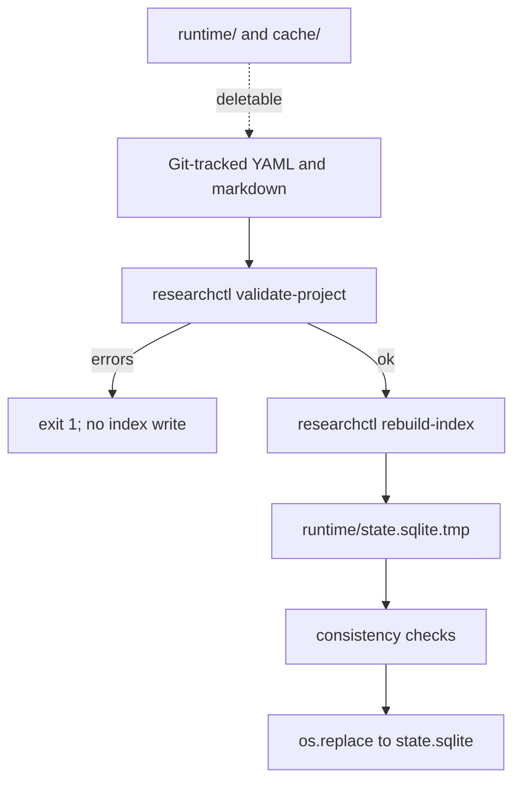

# R0 Kernel — architecture completion and schema design

This is the implementation-ready R0 plan. It does **not** authorize implementation until the human-approval questions in section 21 are decided.

**STOP after this plan.** No file changes, installs, commits, or R1/R2 work.

---

## 1. Verified current repository state

Inspected `/home/nicacevedo/research/research-os` on 2026-09-08.

**Git**
- Branch: `r0/kernel-v1`, clean, even with `main` and `origin/main`
- Single commit: `e35414f` *Bootstrap Research OS foundation* (Nicolás Acevedo Villena)
- Remote: `git@github.com:nicacevedo/research-os.git`

**Tracked files that exist and have substance**
- [DESIGN_INVARIANTS.md](DESIGN_INVARIANTS.md) — complete constitution (15 invariants + XDG boundaries + change control)
- [ARCHITECTURE.md](ARCHITECTURE.md) — **incomplete**: 24 lines, section 1 operating-model diagram cuts off; no capsule, CLI, SQLite, or release boundary
- [pyproject.toml](pyproject.toml) — `research-os 0.1.0`, `requires-python = ">=3.12,<3.13"`, **zero runtime dependencies**, entry point `researchctl = research_os.cli:main`, `uv_build`
- [src/research_os/__init__.py](src/research_os/__init__.py) — `__version__ = "0.1.0"`
- [src/research_os/cli.py](src/research_os/cli.py) — `argparse` with `version` and `doctor` only
- [.python-version](.python-version) — `3.12`
- [.gitignore](.gitignore) — already ignores `**/.research/runtime/`, `.venv/`, secrets, caches
- [uv.lock](uv.lock) — editable `research-os` only; `uv lock --check` passes

**Tracked files that exist but are empty (0 bytes)**
- `README.md`, `ROADMAP.md`, `SECURITY.md`, `MACHINE_AUDIT.md`

**Absent (R0 gaps, not errors)**
- No tests, schemas, config loader, capsule/init, registry, SQLite indexer, docs beyond the stubs
- No `src/research_os/` modules besides `__init__.py` and `cli.py`

**Runtime checks (not redoing machine setup)**
- `uv 0.12.10`; `uv run researchctl version` → `0.1.0`
- `uv run researchctl doctor` all PASS (Python 3.12.14, git, sqlite3 3.45.1, four XDG dirs)
- `uv run python --version` → 3.12.14
- Doctor does **not** check XDG writability, config presence, or Git identity

**Host XDG (already created; empty R1-shaped subdirs present)**
- `~/.config/research-os` — empty (no `config.toml`, no `secrets.env`)
- `~/.local/share/research-os/{literature/{citation_graph,indexes,metadata,parsed,pdf},shared_knowledge}`
- `~/.cache/research-os/{api,embeddings,llm,tmp}`
- `~/.local/state/research-os/{checkpoints,logs,scheduler}`

These subdirs are **bootstrap leftovers**, not an R0 contract. R0 must not populate them, must not require them, and must not delete them.

**Conflicts with invariants:** none in executable code. Documentation debt is the issue: empty SECURITY/MACHINE_AUDIT/README/ROADMAP, truncated ARCHITECTURE. Invariants file is the only complete architectural source.

**Non-conflict observation:** `cli.py` hardcodes Linux XDG paths under `Path.home()`, matching DESIGN_INVARIANTS. Fine for this host; do not add `platformdirs` in R0.

---

## 2. Gaps against R0

| R0 requirement | Current state |
|---|---|
| Architecture contract | Truncated ARCHITECTURE.md |
| Machine audit / security / roadmap / README | Empty files |
| Central config model | None |
| Research Capsule v1 | Not implemented; `.gitignore` already anticipates `runtime/` |
| Canonical schemas + IDs + lifecycle | None |
| Validation | None |
| `init-project` / `validate-project` / `rebuild-index` / `projects` / `status` | Missing |
| Project registry | None |
| Project-local SQLite | None |
| Provenance primitives | None (Git history of the kernel repo only) |
| Tests | None |
| Dependencies for YAML | Unchosen |

`researchctl version` / `doctor` are the only completed R0 slices.

---

## 3. R0 scope and explicit non-goals

**In scope:** durable scientific-state kernel — docs, capsule layout, YAML object schemas, IDs/refs/lifecycle, deterministic validation, `researchctl` commands above, explicit project registry, rebuildable `.research/runtime/state.sqlite`, minimal experiment provenance *fields*, XDG path helpers, pytest (+ ruff as dev), isolation/failure tests.

**Explicit non-goals (do not implement, do not stub as fake APIs):** OpenAlex, Semantic Scholar, arXiv, Crossref, PaperQA, PyMuPDF, GROBID, embeddings, SentenceTransformers, BM25/citation ranking, LangGraph, Blind/Seed/Skeptic Explorers, LLM adapters, Claude Code / Codex, Slurm/HPC, worktree execution, Docker/Podman/Apptainer, MCP, PostgreSQL, vector DBs, Ollama/local LLMs, web UI, systemd watchers, paper/referee agents, firmware/Secure Boot/MOK, network services, privileged OS changes.

**Also out of R0 object schemas:** Work Orders, Handoffs, RUN records as canonical science (directories may exist empty; files if present → WARNING, not indexed).

---

## 4. Exact target repository tree

After R0 (kernel repo only; no `.research/` capsule inside `research-os`):

```text
~/research/research-os/
├── DESIGN_INVARIANTS.md          # unchanged unless a true conflict is found (none expected)
├── ARCHITECTURE.md               # complete R0 contract
├── ROADMAP.md                    # R0–R5, R2 as first scientific-value target
├── SECURITY.md
├── MACHINE_AUDIT.md
├── README.md
├── docs/
│   └── CAPSULE.md                # object/schema/ID/lifecycle spec for reviewers
├── pyproject.toml
├── uv.lock
├── .python-version
├── .gitignore
├── src/research_os/
│   ├── __init__.py
│   ├── cli.py                    # argparse dispatch only
│   ├── errors.py                 # exit codes, Error dataclass
│   ├── paths.py                  # XDG + capsule paths + test overrides
│   ├── config.py                 # optional config.toml
│   ├── ids.py
│   ├── models.py                 # dataclasses + parse
│   ├── capsule.py                # init layout, locate project
│   ├── validate.py
│   ├── registry.py               # global registry.toml
│   └── index.py                  # sqlite rebuild
└── tests/
    ├── conftest.py
    ├── test_ids.py
    ├── test_paths.py
    ├── test_config.py
    ├── test_models.py
    ├── test_validate.py
    ├── test_capsule.py
    ├── test_registry.py
    ├── test_index.py
    ├── test_cli.py
    ├── test_isolation.py
    ├── test_integration_rebuild.py
    ├── test_failures.py
    └── fixtures/                 # only temp copies used at runtime
```

No empty `literature/`, `agents/`, `execution/` packages.

---

## 5. Research Capsule v1 proposal

A project becomes Research-OS-aware by adding `.research/` inside an **existing Git repository**.

```text
.research/
├── project.yaml
├── CHARTER.md
├── STATE.md
├── questions/
├── ideas/
├── hypotheses/
├── assumptions/
├── claims/
├── decisions/
├── work_orders/          # reserved empty in R0; not parsed
├── experiments/
│   └── EXP-0001/
│       └── manifest.yaml
├── reviews/
├── literature/           # project-local evidence objects (EVI-*), not a paper corpus
├── handoffs/             # reserved empty in R0; not parsed
└── runtime/              # gitignored
    └── state.sqlite      # rebuildable; may be absent
```

**Canonical objects:** one YAML file per object (experiments: one directory + `manifest.yaml`). CHARTER.md and STATE.md are human narrative, existence-checked, not schema-parsed.

**CLI must never rewrite canonical files** except `init-project` creating templates on a missing capsule.



---

## 6. Canonical object/schema proposal

Shared envelope on every YAML object:

- **Required:** `id` (string), `type` (enum), `schema_version` (int, R0 = 1), `status` (per-type enum), `title` (non-empty string)
- **Optional:** `notes` (string), `created_from` (list of IDs), `supersedes` (ID or null), `superseded_by` (ID or null)
- **Forbidden:** secrets, API keys, timestamps-as-provenance, numeric `confidence`, unknown fields (strict)
- **No timestamps** in canonical YAML (Git is history). Index may store `indexed_at` as runtime metadata.

Unknown extra YAML files in reserved dirs (`work_orders/`, `handoffs/`): **WARNING**. YAML in a typed dir that fails schema: **ERROR**. Extra `.md` in object dirs: **WARNING**.

### Project — `project.yaml` (R0)

- **Purpose:** capsule identity; not science.
- **Required:** `id` (slug), `title`, `capsule_version` (int = 1), `status` (`active` | `paused` | `archived`)
- **Optional:** `description`
- **No:** secrets, HPC/execution blocks, paths to home directory that would leak machine layout into git

### Question — `questions/Q-NNNN.yaml` (R0)

- **Purpose:** durable open question.
- **Required extra:** `statement`
- **Status:** `open` | `paused` | `answered` | `withdrawn` | `superseded`
- **Refs:** `created_from` any; typically none

### Idea — `ideas/IDEA-NNNN.yaml` (R0)

- **Purpose:** pre-hypothesis exploration. Promotion = new Hypothesis with `created_from: [IDEA-…]`, not type mutation.
- **Required extra:** `statement`
- **Status:** `draft` | `active` | `promoted` | `discarded` | `superseded`
- **`promoted`:** WARNING if no hypothesis `created_from` this ID (not ERROR; timing)

### Hypothesis — `hypotheses/HYP-NNNN.yaml` (R0)

- **Purpose:** falsifiable proposition. **Not** a mega-lifecycle that swallows ideas/experiments.
- **Required extra:** `statement`
- **Required when `status != draft`:** `falsification` (non-empty)
- **Optional:** `mechanism`, `addresses` (Q- IDs), `assumptions` (ASM- IDs), `supporting_evidence` (EVI-), `contrary_evidence` (EVI-)
- **Status:** `draft` | `active` | `testing` | `supported` | `rejected` | `inconclusive` | `withdrawn` | `superseded`
- **`supported` / `rejected`:** ERROR unless at least one of supporting/contrary evidence lists is non-empty and resolvable (rejected may use contrary_evidence only)
- **Omit** `confidence` (false precision)

### Assumption — `assumptions/ASM-NNNN.yaml` (R0)

- **Required extra:** `statement`, `scope`
- **Status:** `active` | `relaxed` | `withdrawn` | `superseded`

### Claim — `claims/CLAIM-NNNN.yaml` (R0)

- **Required extra:** `statement`
- **Optional:** `evidence` (EVI- IDs), `hypotheses` (HYP- IDs)
- **Status:** `draft` | `evidence_linked` | `accepted` | `withdrawn` | `superseded`
- **`evidence_linked` and `accepted`:** ERROR if `evidence` empty or dangling
- **R0 does not require a Review object to accept a claim** (R4). Policy hole vs invariant 8 is explicit (section 21 Q2)

### Decision — `decisions/DEC-NNNN.yaml` (R0)

- **Required extra:** `statement`, `rationale`, `alternatives_considered` (list of strings, min 1 when status is `accepted`)
- **Optional:** `related` (IDs)
- **Status:** `proposed` | `accepted` | `withdrawn` | `superseded`

### Experiment — `experiments/EXP-NNNN/manifest.yaml` (R0)

- **Purpose:** scientific identity of an experiment, **not** an executor.
- **Required extra:** `purpose`
- **Optional until non-draft:** `hypotheses` (HYP-); **required non-empty when status ≠ `draft`**
- **Status:** `draft` | `specified` | `running` | `completed` | `failed` | `withdrawn` | `superseded`
- **No `audited` status** (audit lives on Review)
- **When `completed`:** require `provenance` object with non-empty strings: `code`, `config`, `data`, `git_commit` (values may be repo-relative paths or explicit `none: <reason>` is **not** allowed to bypass; if genuinely N/A, human writes a Decision and keeps experiment non-completed). Practical R0 rule: all four keys required, non-empty; content not resolved by the kernel
- **Do not** store run logs, metrics, or artifacts in the manifest in R0

### Review — `reviews/REV-NNNN.yaml` (R0)

- **Purpose:** independent evaluation record; the frozen-packet *seed* for later R4 (file is the context, not a chat)
- **Required extra:** `subject` (ID), `reviewer_kind` (`human` | `independent`)
- **Optional:** `findings`, `verdict`
- **Status:** `draft` | `submitted` | `concluded` | `withdrawn`
- **When `concluded`:** `findings` and `verdict` required (`approve` | `reject` | `revise`)
- **Cannot** encode “same agent session” cryptographically; `reviewer_kind: independent` is a declared role

### Evidence — `literature/EVI-NNNN.yaml` (R0)

- **Purpose:** **project-local interpretation** of evidence. Shared paper bodies belong to R1 global library.
- **Required extra:** `kind` (`literature` | `experiment` | `other`), `statement` (what is being taken as evidence *here*)
- **If `literature`:** required `citation` (human string); optional `global_ref` (opaque string: DOI, arXiv id, or future paper id — **not resolved in R0**)
- **If `experiment`:** required `experiment` (EXP- ID)
- **If `other`:** required `citation` or `notes` (at least one non-empty)
- **Status:** `active` | `withdrawn` | `superseded`
- **No `PAPER-` objects in R0**

### Deferred (empty dirs only)

- **Work Order:** R3 protocol; indexing it now hard-codes execution semantics
- **Handoff:** R4/R5; Review files already cover frozen context
- **Run:** see section 12

---

## 7. ID, reference, lifecycle, immutability, supersession, and schema-version design

### Recommendation: ID grammar

- Syntax: `^(Q|IDEA|HYP|ASM|CLAIM|DEC|EXP|REV|EVI)-[0-9]{4,}$`
- Case: prefixes uppercase; digits only after one hyphen
- Width: at least 4, zero-padded; `HYP-10000` allowed (no wrap)
- Scope: unique **within project across all types** (type prefix makes `HYP-0001` and `CLAIM-0001` distinct)
- Filename: stem equals ID (`Q-0001.yaml`; experiment dir `EXP-0001/manifest.yaml`)
- Assignment: human (or later helper); next number is max(existing)+1, no reuse of withdrawn numbers
- Immutable: changing `id` is a different object; old file must remain or refs break
- No UUIDs, no SQLite rowids as identity
- Project `id`: separate grammar `^[a-z][a-z0-9-]{1,62}$` (global on this machine via registry)

**Alternatives:** UUIDs (opaque, bad diffs); type-namespaced uniqueness only (weaker duplicate detection); `PAPER-`/`WO-`/`RUN-` in R0 (premature).

**Downside:** 4-digit aesthetic breaks at 10000 (allowed). **Confidence: 0.84**

### References

Allowed edges (ERROR if target missing or wrong type):

- `created_from`: any existing ID
- `supersedes` / `superseded_by`: same `type`
- Hypothesis `addresses` → Q; `assumptions` → ASM; evidence lists → EVI
- Claim `evidence` → EVI; `hypotheses` → HYP
- Experiment `hypotheses` → HYP
- Review `subject` → Q | IDEA | HYP | ASM | CLAIM | DEC | EXP | EVI | REV (REV-of-REV allowed, not required)
- Evidence `experiment` → EXP

**Dangling:** ERROR. **Forward refs:** not allowed (same as dangling). **Duplicate IDs:** ERROR. **Cycles** in `supersedes` / `created_from`: ERROR. **Invalid type:** ERROR.

Validation **never** rewrites files to “fix” refs.

Severities: `ERROR` (exit 1), `WARNING` (exit 0 if no errors), `INFO` (e.g. no index yet).

### Lifecycle (per type, not one mega-pipeline)

Do **not** adopt IDEA→CANDIDATE→HYPOTHESIS→DESIGN_READY→TESTING as kernel status. That is R2 portfolio workflow. Types stay distinct; `created_from` records promotion.

Do **not** adopt EXPLORATORY→REPRODUCED→AUDITED→ACCEPTED as a second global maturity enum. Experiment status + Review + Claim status already cover it without a fourth ontology.

**Terminal statuses** (`withdrawn`, `superseded`, plus hypothesis `supported|rejected|inconclusive`, claim `accepted`, experiment `completed|failed`, review `concluded`): documented as non-rewind. **R0 does not git-diff previous YAML to enforce edges** (dirty trees, first commit, and Git coupling). Kernel enforces *status ∈ enum* and *status-conditioned invariants* only.

**Human gate:** freeze these enums (section 21 Q1). **Confidence on skipping git-based transition checking: 0.70**

### Immutability (policy; R0 cannot see previous file version unless later `--against-git`)

- **Immutable:** `id`, `type`, filename/dir binding
- **Mutable while non-terminal:** `status`, `title`, statements, evidence lists, notes, `falsification`, `mechanism`
- **Append-oriented:** `created_from`, `superseded_by` (should only be set at supersession)
- **Derived / runtime-only:** SQLite columns, hashes, `indexed_at`, registry `last_seen`
- **`schema_version`:** changed only by a future explicit migrator (none in R0)

### Deletion and supersession

- Prefer `status: withdrawn` or `superseded` + `superseded_by`
- Supersession: new ID; old file remains; both pointers should agree (WARNING if one-sided)
- Physical delete: allowed by Git/user; kernel does not delete. If others still reference it → ERROR on validate
- No `researchctl delete`

### Schema versions (three planes)

1. **Package version** (`pyproject` / `researchctl version`) — kernel software; stay `0.1.0` until R0 accepted
2. **Capsule version** (`project.yaml: capsule_version: 1`) — compatibility gate; unknown → ERROR, no auto-migrate
3. **Object `schema_version: 1`** — per-file; must be 1 in R0

**No migrator in R0.** Smallest evolution path: bump capsule_version in a later release with an explicit, reviewed, deterministic tool that refuses to guess scientific meaning.

**Confidence: 0.86**

---

## 8. SQLite materialized-index design

Path: `.research/runtime/state.sqlite` (gitignored).

**Tables**
- `meta(key TEXT PRIMARY KEY, value TEXT)` — `index_schema_version=1`, `capsule_version`, `source_commit` (if git available, else empty), `object_count`
- `objects(id TEXT PRIMARY KEY, type TEXT, status TEXT, title TEXT, schema_version INTEGER, source_path TEXT, content_sha256 TEXT, payload_json TEXT)`
- `refs(from_id TEXT, to_id TEXT, rel TEXT, PRIMARY KEY(from_id, to_id, rel))`

Indexes: `objects(type, status)`, `refs(to_id)`.

`payload_json` is a cache of the parsed object, **not** truth. Canonical files always win.

**Rebuild algorithm (strict default)**
1. Locate capsule; refuse to touch anything outside `.research/runtime/`
2. Run full validation; **any ERROR → abort, leave old DB in place**
3. Write new DB to `state.sqlite.new` in the same directory
4. Insert meta, objects, refs; `content_sha256` = SHA-256 of **file bytes**
5. Consistency: every ref endpoint exists in `objects`; counts match memory
6. `os.replace(state.sqlite.new, state.sqlite)` (POSIX atomic)
7. Never mutate YAML

**Halfway failure:** leftover `state.sqlite.new` ignored; next rebuild overwrites it. Old DB remains.

**Disagreement SQLite vs files:** files win; `status`/`rebuild-index` repairs. Never write SQLite back to YAML.

**Corruption:** replace via rebuild; if validate fails, report and keep corrupted DB (operator may delete the file and retry after fixing YAML).

**Malformed objects:** not indexed (because rebuild never starts). No permissive mode in R0.

**Do not** implement a second state machine (no status transitions stored only in SQL).

---

## 9. Global project-registry design

**Recommendation:** `~/.local/share/research-os/registry.toml` (not SQLite).

Why: N projects is tiny; humans can inspect/edit stale paths; avoids a second database that people might treat as scientific truth; project repos remain authoritative.

```toml
[[project]]
id = "example-slug"
path = "/abs/path/to/repo"
title = "..."
capsule_version = 1
status = "active"
# last_seen omitted from file; optional, only if we accept implicit writes — R0: omit
```

- **Discovery:** explicit only (`init-project` registers; later `researchctl register <path>` as a thin alias of init’s registry write)
- **No scan** of `~/research/`
- **Duplicate ID, different path:** ERROR
- **Same ID, same path:** idempotent update of title/status from `project.yaml`
- **Stale path:** `projects` prints `MISSING`; does not auto-delete
- **Moved repo:** register the new path (old row replaced after ID match + user command); do not guess
- **Rebuildability:** not from the filesystem; lost registry ⇒ re-register. Science unchanged
- **XDG override for tests:** `RESEARCH_OS_DATA_HOME` etc.

**Confidence: 0.73** (brief suggested SQLite; TOML is the deliberate deviation)

---

## 10. CLI contract

Keep **argparse** (already present). Exit codes: `0` ok, `1` validation/runtime failure, `2` usage / not a project / bad args.

| Command | Mutation | Git dirty OK? | Notes |
|---|---|---|---|
| `version` | none | yes | print `__version__` |
| `doctor` | none | yes | existing checks + **XDG writable**; do not create dirs; do not require R1 subdirs or config.toml |
| `init-project [path]` | create `.research/**` templates, maybe append `.gitignore`, register | yes | **requires existing git repo**; refuse if `.research/` exists (no `--force` in R0) |
| `validate-project [path]` | **none** | yes | human stdout; `--json`; warnings don’t fail |
| `rebuild-index [path]` | `.research/runtime/state.sqlite` only | yes | requires validate ERROR-free |
| `projects` | none | n/a | list registry; mark MISSING |
| `status [path]` | none | yes | counts from **files**; mention index present/absent as INFO |

Path resolution: use `path` (default `.`); find `path/.research` or walk up to the Git root, not beyond. Do not walk out of the repo.

**`init-project` creates:** `project.yaml` (id default = directory slug, must validate; if invalid, require `--id`), `CHARTER.md` and `STATE.md` headings-only templates, typed directories including empty `work_orders/` and `handoffs/`, `runtime/` directory, append `.research/runtime/` to project `.gitignore` if missing. **No example science objects.**

**`validate-project` layers:** structure → YAML parse → schema → IDs → refs → status-conditioned evidence/provenance → isolation (no absolute paths into other projects’ `.research/`). Codes like `E_DUP_ID`, `E_DANGLING_REF`, `E_ACCEPTED_WITHOUT_EVIDENCE`.

No `create-hypothesis` and no R1+ command names.

---

## 11. Configuration and security design

**R0 required config: none.** Empty `~/.config/research-os` is valid.

Optional `~/.config/research-os/config.toml` if present: unknown keys ERROR. Allowed later-compatible empty tables only, e.g. `[paths]` overrides — actually **prefer env overrides for tests**, not config:

- `RESEARCH_OS_CONFIG_HOME`
- `RESEARCH_OS_DATA_HOME`
- `RESEARCH_OS_CACHE_HOME`
- `RESEARCH_OS_STATE_HOME`

If unset, use the DESIGN_INVARIANTS XDG paths.

**`secrets.env`:** do not create, do not load, do not mention values. SECURITY.md documents future `chmod 600` location. R0 code paths never read it.

**Never:** print secrets, put secrets in YAML/SQLite, scrape browser subscriptions, touch firmware/MOK/Secure Boot, `sudo`, systemd, SSH, GitHub auth.

Doctor: FAIL if an XDG dir exists but is not writable (report path; tell human to fix ownership). Do not `chown` automatically.

---

## 12. Provenance boundary

**Recommendation: split, and keep R0 tiny.**

| Kind | Where | R0 |
|---|---|---|
| Scientific identity | Git-tracked YAML | yes |
| Change history | Git | yes (not duplicated as timestamps) |
| Index integrity | `content_sha256` in SQLite | yes |
| Experiment traceability | `provenance.{code,config,data,git_commit}` on **completed** EXP | yes (pointers only) |
| Execution runs, costs, models, logs | `.research/runtime/` (future) | **defer** |
| Canonical `RUN-*.yaml` | — | **defer** (would confuse runs with evidence) |

Kernel version for later runs: `researchctl version` + git commit of `research-os` recorded by **future** executors, not by R0 validate.

**Confidence: 0.80**

---

## 13. Minimal dependency proposal

**Runtime**
- **PyYAML** — stdlib has no YAML; capsule is YAML. Use `yaml.safe_load` only; **never round-trip-write** scientific files (so ruamel is unnecessary). Alternative: JSON (rejected: human editing). **Confidence: 0.90**
- **stdlib:** `argparse`, `tomllib`, `sqlite3`, `hashlib`, `pathlib`, `json`, `os.replace`

**Dev**
- **pytest** — required for the acceptance tests
- **ruff** — cheap deterministic lint; no doctor dependency

**Reject for R0:** pydantic (semantics belong in explicit validators), typer, platformdirs, jsonschema, ruamel.yaml.

Do not install during this planning task. Implementation milestone 1 adds PyYAML + pytest + ruff via `uv add` **after plan approval**.

---

## 14. Unit-test plan

All tests use tmp fixtures + XDG env overrides. Never the user’s real `~/.local/share/research-os` science (there is none yet) and never real project repos.

Cover: ID parse/format/next-id; filename binding; schema required/optional/unknown fields; each status enum; duplicate IDs; dangling/wrong-type/circular refs; accepted claim without evidence; completed EXP without provenance; promoted idea warning; XDG override paths; missing/invalid config.toml; registry duplicate ID; registry stale path; isolation (two temp projects, IDs may coincide, indexes and validations do not mix); rebuild atomicity; hash changes when bytes change; doctor writability (temp).

---

## 15. Integration-test plan

**Critical acceptance fixture** (exact flow):

1. `git init` temp repo
2. `researchctl init-project`
3. Write representative valid objects: Q, IDEA, HYP (with falsification + EVI), ASM, CLAIM (accepted + EVI), DEC, EXP/manifest (completed + provenance), REV, EVI (literature + experiment kinds)
4. `validate-project` exit 0
5. `rebuild-index` creates `state.sqlite`
6. Snapshot logical state: sorted `(id, type, status, source_path, refs)`
7. Delete `state.sqlite`
8. `rebuild-index` again
9. Compare logical snapshots — **equivalent**
10. Corrupt DB bytes; rebuild again — equivalent
11. Delete entire `runtime/`; rebuild — equivalent; YAML untouched

Also: two temp projects with the same `HYP-0001`; registry lists both; validate A does not read B.

---

## 16. Failure-injection plan

| Case | Expected |
|---|---|
| Malformed YAML | ERROR parse, rebuild aborted |
| Valid YAML, bad schema | ERROR, not indexed |
| Bad ID / type vs directory | ERROR |
| Duplicate ID | ERROR |
| Dangling ref | ERROR |
| Claim `accepted` no evidence | ERROR |
| Hypothesis `supported` no evidence | ERROR |
| EXP `completed` missing provenance | ERROR |
| Partial/truncated file | ERROR parse |
| Corrupted sqlite | rebuild replaces if YAML valid |
| Missing `runtime/` | rebuild creates it |
| `init-project` when `.research/` exists | exit 2, no overwrite |
| Duplicate project ID in registry | ERROR |
| Stale registry path | `projects` shows MISSING |
| Extra YAML in `work_orders/` | WARNING, not indexed |
| Unknown `capsule_version` | ERROR |

---

## 17. Documentation changes

- **DESIGN_INVARIANTS.md** — keep as-is (no invariant edits)
- **ARCHITECTURE.md** — finish operating model; filesystem boundaries; capsule vs SQLite vs registry; CLI; R0/R1+ cut; “canonical files win”
- **docs/CAPSULE.md** — field-level spec (reviewer packet)
- **ROADMAP.md** — R0 Kernel, R1 Literature, R2 Co-Explorer (first major scientific-value target), R3 Experimentalist, R4 Author/Referee, R5 Autonomous OS; postponed tech list
- **SECURITY.md** — secrets location/permissions; no privileged/firmware/MOK/Secure Boot automation; no scraping; no secrets in git/logs/SQLite/YAML; budgets deferred; agent vs human authority
- **MACHINE_AUDIT.md** — Ubuntu 24.04.5 LTS; kernel 6.8.0-139-generic; uv 0.12.10; CPython 3.12.14 isolated; sqlite 3.45.1; Secure Boot **intentionally disabled** after MOK volume-full recovery; battery telemetry unreliable; XDG dirs exist including **empty bootstrap subdirs** (literature/embeddings/scheduler…) **not** part of R0; Research OS must never touch UEFI/MOK
- **README.md** — what R0 is; `uv sync`; `researchctl` commands; init/validate/rebuild; this repo is not a science project; later releases not pretended

Independent review packet later: this approved plan + base `e35414f` + implementation diff + test results + the six docs + `docs/CAPSULE.md`. No builder chat log.

---

## 18. Implementation sequence (4 milestones)

Five docs-only commits would stall a working tree. Four milestones, each leaving `version`/`doctor` working:

**M1 — Contract + package foundation**
Fill the six docs + `docs/CAPSULE.md`; add PyYAML/pytest/ruff; `paths.py`, `errors.py`, `config.py`; extend doctor writability; unit tests for paths/config. No schema freeze in code until section 21 is approved — **if approval is given with this plan, M1 includes the frozen enums in CAPSULE.md**.

**M2 — Models, IDs, validators**
`ids.py`, `models.py`, `validate.py` + unit tests (the scientific kernel). Still no CLI commands except existing ones.

**M3 — Capsule + registry + CLI**
`capsule.py`, `registry.py`; `init-project`, `validate-project`, `projects`, `status`; CLI tests including refuse-overwrite.

**M4 — Index + acceptance**
`index.py`; `rebuild-index`; isolation + critical rebuild integration + failure injection; README validation of the command set; freeze R0 on `r0/kernel-v1`.

Do not mix R1 literature dirs or agent modules into any milestone.

---

## 19. R0 acceptance/release gates

Must work on a **temporary** git repo:

```bash
researchctl version
researchctl doctor
researchctl init-project <tmp>
researchctl validate-project <tmp>
researchctl rebuild-index <tmp>
```

Plus: delete/corrupt `state.sqlite` → rebuild logical equivalence; isolation; duplicate ID rejected; dangling ref rejected; accepted claim without evidence rejected; malformed YAML never indexed; deleting `runtime/` does not delete YAML; `init-project` is non-destructive; doctor does not require firmware, R1 subdirs, or secrets.

Do not declare R0 done on unit tests alone.

---

## 20. Risks and likely architectural failure modes

- **Schema too broad** — mitigation: 9 object types only; no WO/RUN/PAPER; no confidence/timestamps
- **Schema too narrow** — `notes` + `created_from` absorb leftovers; capsule_version 2 later
- **Overfit one project** — field set is discipline-agnostic (statement/falsification/evidence)
- **SQLite as truth** — CLI never writes YAML from DB; tests delete DB
- **Cross-project leakage** — no global science index; EVI `global_ref` is an opaque string; isolation tests; do not read `shared_knowledge/` in R0
- **Dependency coupling** — PyYAML + pytest + ruff only
- **Premature abstractions** — no empty packages for R1+
- **ID grammar rigidity** — `{4,}` digits; new prefixes via capsule_version
- **Lifecycle encodes bad science** — separate types; no mega-pipeline; no fake transition engine
- **Destructive validation** — validate is read-only
- **Silent migration** — no migrator
- **Runs confused with evidence** — RUN deferred; EVI is the evidence type
- **Registry becomes canonical** — TOML pointers only; MISSING is display not deletion
- **CLI implicit mutation** — only init (new capsule) and rebuild (runtime DB)
- **Need Research OS to read science** — YAML/MD are readable in git
- **Verbose objects** — small required field set; optional notes
- **Noisy diffs** — no auto-rewrite; no timestamp churn
- **Version bureaucracy** — three planes, only integers, no framework
- **R1/R2 hardcoded** — do not require literature subdirs; do not parse WO; existing XDG leftovers documented as non-contract

---

## 21. Questions requiring human approval

Trivial/technical items (argparse vs typer, atomic replace, test tmpdirs) are **not** listed.

### Q1 — Freeze R0 object types and status enums as in section 6
- **Recommended:** yes
- **Rationale:** kernel needs a closed vocabulary; promotion is `created_from`, not type change
- **Alternatives:** mega-lifecycle; fewer types (merge idea/hypothesis — loses scientific distinction)
- **Consequences:** R2 explorers must emit these files; changing enums needs capsule_version 2
- **Confidence: 0.82**

### Q2 — May a claim be `accepted` with evidence IDs only (no Review)?
- **Recommended:** yes for R0; Review-gated acceptance in R4
- **Rationale:** invariant 8 cannot be cryptographically enforced now; requiring REV would fake independence
- **Alternatives:** forbid `accepted` until R4; require `reviewer_kind: human` Review
- **Consequences:** an agent could write `status: accepted`; policy/docs must say humans own acceptance
- **Confidence: 0.68**

### Q3 — ID grammar and prefixes (including `EVI-`, excluding `PAPER-`/`WO-`/`RUN-`)
- **Recommended:** adopt section 7
- **Confidence: 0.84**

### Q4 — Work orders / handoffs / runs as empty dirs, not schemas
- **Recommended:** yes
- **Confidence: 0.83**

### Q5 — Canonical format YAML (PyYAML read-only)
- **Recommended:** yes
- **Alternatives:** JSON; Markdown+frontmatter
- **Confidence: 0.88**

### Q6 — `init-project` requires an existing Git repository
- **Recommended:** yes (invariant 6)
- **Alternatives:** warn-only
- **Confidence: 0.80**

### Q7 — Project IDs are slugs, not `PROJ-0001`
- **Recommended:** yes
- **Confidence: 0.81**

### Q8 — Do not enforce status *edges* from Git history in R0
- **Recommended:** enums + conditioned invariants only
- **Alternatives:** `--against-git` transition checker now
- **Confidence: 0.70**

### Q9 — Dependencies: PyYAML + pytest + ruff; no pydantic/typer/platformdirs
- **Recommended:** yes
- **Confidence: 0.86**

### Q10 — Global registry as `registry.toml`, not SQLite
- **Recommended:** yes (deviation from the example path)
- **Confidence: 0.73**

### Q11 — No timestamps / no numeric confidence in canonical YAML
- **Recommended:** omit both
- **Confidence: 0.77**

### Q12 — Unknown YAML fields are errors (strict)
- **Recommended:** yes
- **Confidence: 0.80**

### Q13 — Completed experiments require four provenance pointer strings
- **Recommended:** yes (`code`, `config`, `data`, `git_commit`)
- **Confidence: 0.78**

### Q14 — `supported`/`rejected` hypotheses require at least one EVI id
- **Recommended:** yes
- **Confidence: 0.80**

### Q15 — Do not auto-create or auto-delete bootstrap XDG R1 subdirs
- **Recommended:** document only
- **Confidence: 0.90**

### Q16 — Physical file deletion is a Git/user act; kernel uses withdrawn/superseded
- **Recommended:** yes
- **Confidence: 0.85**

### Q17 — Keep DESIGN_INVARIANTS.md unchanged
- **Recommended:** yes
- **Confidence: 0.93**

**Schema freeze:** none of the above is frozen until you approve (or amend) this list.

---

## 22. Invariant-by-invariant compliance audit

- **1 Local before LLM — PASS.** R0 is parse/validate/index/CLI only; no model calls.
- **2 No continuously thinking agents — PASS.** No services, watchers, or loops.
- **3 Expensive reasoning event-triggered — PASS.** Vacuous: no reasoning component.
- **4 Scientific state project-isolated — PASS.** Objects live under each repo’s `.research/`; isolation tests; registry stores paths not science.
- **5 Literature may be globally shared — RISK (not conflict).** R0 only has project-local EVI + opaque `global_ref`; global library is R1. Correction: do not invent a paper DB now; do not read `~/.local/share/research-os/literature` in R0.
- **6 Git-tracked files are truth — PASS.** YAML/MD in git; SQLite gitignored; validate does not rewrite.
- **7 SQLite rebuildable — PASS.** `rebuild-index` atomic replace; critical test deletes DB.
- **8 No self-approval — RISK.** Separate Review type and no experiment `audited` status; claim `accepted` is not review-gated (Q2). Correction if you reject Q2: require a concluded independent/human Review before `accepted`.
- **9 Clean reviewer context — RISK.** Review YAML is a frozen file, but R0 does not export a review packet tooling. Sufficient seed; R4 completes it. No chat context in kernel.
- **10 Claims traceable to evidence — PASS.** `accepted`/`evidence_linked` require resolvable EVI IDs.
- **11 Experiments traceable to code/config/data/version — PASS.** Enforced on `completed`; kernel does not fetch or hash those artifacts in R0 (pointer-level only). RISK: pointers can be lies; hashing is R3.
- **12 Paid APIs need budgets — PASS (vacuous).** No APIs; SECURITY.md records the future constraint.
- **13 No unofficial browser automation — PASS.** No network adapters.
- **14 Finite agent loops — PASS.** No agents.
- **15 Explicit cross-project transfer — PASS / RISK.** No cross-project reads; `shared_knowledge/` leftover must stay unused. Correction: R0 code must not import or scan it.

No **CONFLICT** requiring an invariant document change.

---

## 23. Final recommended R0 plan

Build the smallest durable kernel on branch `r0/kernel-v1`:

1. Treat Git-tracked YAML in `.research/` as the only scientific truth; SQLite is a disposable index; registry is a disposable path list (TOML).
2. Nine object types (project + Q/IDEA/HYP/ASM/CLAIM/DEC/EXP/REV/EVI); empty reserved dirs for work_orders/handoffs; no RUN/PAPER/WO schemas.
3. Deterministic, non-mutating validation; strict rebuild-or-nothing indexing.
4. CLI: keep argparse; add init/validate/rebuild/projects/status; extend doctor with writability.
5. Dependencies: PyYAML + pytest + ruff only.
6. Four milestones after **human approval of section 21**.
7. Do not touch firmware, MOK, Secure Boot, networking, systemd, or real scientific repos.
8. Do not start R1/R2.

**Self-review (section 44):** dropped pydantic, typer, unified mega-lifecycle, git-enforced transitions, canonical runs, WO schema, JSON Schema framework, auto-scanning registry, timestamps/confidence, and empty future packages. Remaining tension is Q2 (claim acceptance vs invariant 8) and Q10 (TOML vs SQLite registry) — both flagged for you, not silently frozen.

---

**STOP.** Do not modify files, install dependencies, commit, push, or implement until this plan and schema are explicitly approved.
